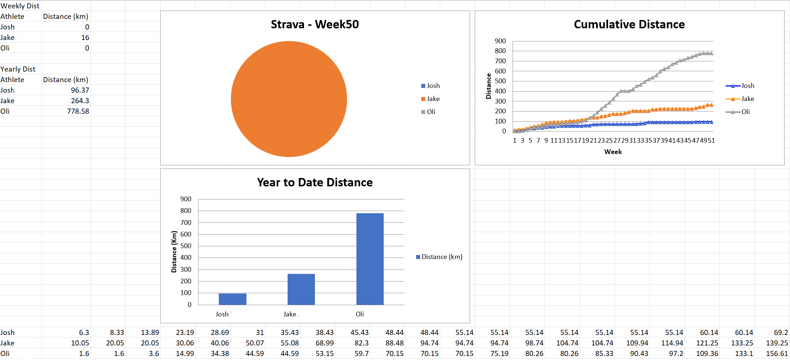
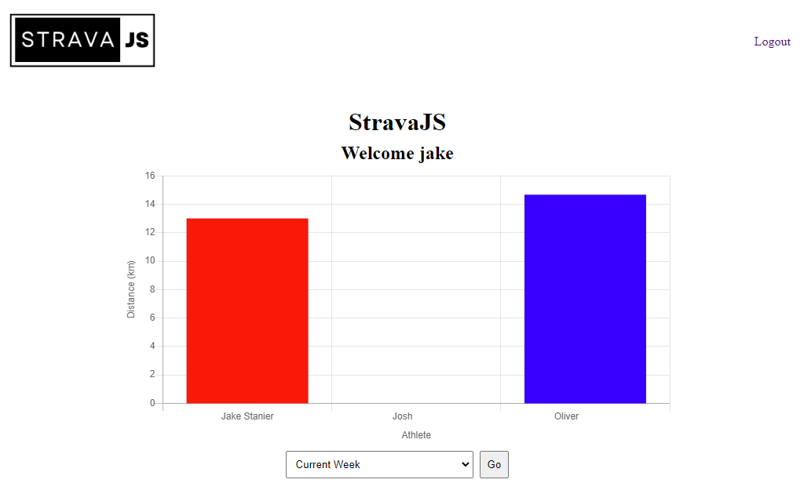
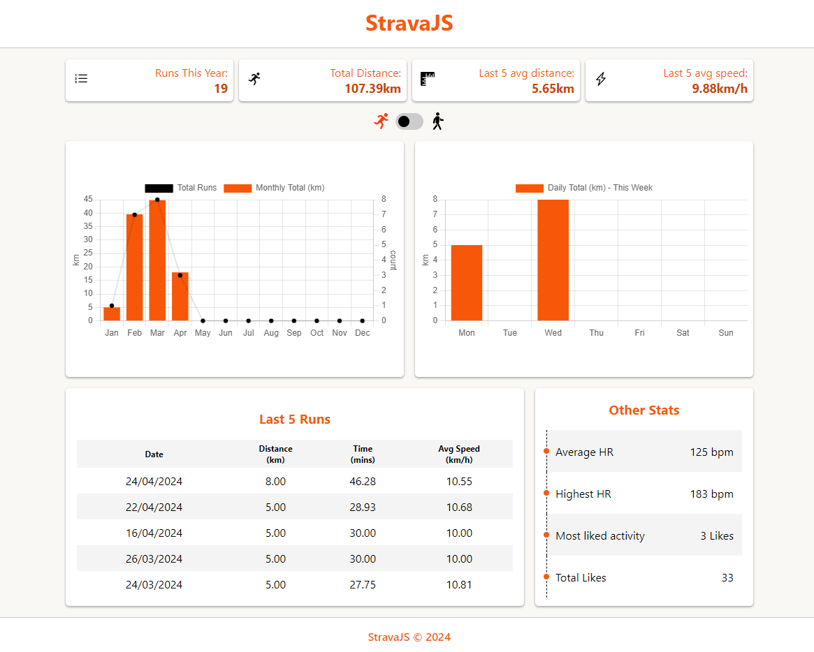

# StravaJS 🏃‍♂️

\*\* This app is now deprecated - [The Run Club](https://github.com/jake-stan92/The-Run-Club) is the latest version \*\*

========================

\*\* the database is currently hosted on a free tier plan. It can take a while to load (up to 1 min 😢) - please be patient 😊

## Description

As a keen activity tracker and a lover of data, I created stravaJS to collate and display activity data in a clear and concise way. Strava doesn’t offer such detailed activity results – at least in the free tier anyway. The idea was initially born when a small group of friends decided to complete a 10k per week running challenge in 2023. The app has gone through 3 iterations to be where it is currently. Using the Strava API, the app collects the activities of given athletes and then filters results accordingly.

## Tech Stack

For this project I decided to use PostgreSQL as a database to store sensitive athlete data. This is easily hosted and maintained on render.
For the back-end I decided to use NodeJS and React (Vite) on the front-end. This choice was made mainly due to ease of continuous deployment as well as wanting to practice developing in both frameworks. The charts themselves were created using ChartJS.

## The Journey

### Iteration 1:

StravaJS started out as a python script that I would run on my local machine to track our 10km a week challenge. The script would output similar data and charts to Excel but I would have to screenshot these and send to my friends. In addition, my friends would have to ask me to run the script each time they wanted to see updated figures.

### Iteration 2:

From here I created the second iteration of the app which used NodeJS as a back-end, MongoDB as a database and PUG (Jade) as a templating language to display the data. This version included user authentication where my friends could login and see their own results. While this edition allowed users to look up their own activities, it contained some bugs and was very unappealing in terms of UI.

### Iteration3 (current):

I completed the current iteration after honing my skills at the School of Code. I went about creating a sleeker looking dashboard with an improved UI and minimal bugs. While the app currently shows only my data, I plan to increase its functionality in the future.

## Future Plans

To scale the apps functionality, I will likely need to contact Strava themselves and request an increased number of athletes authenticated to my app - current default is 1. This way I can use their OAuth system which is more secure and renders the PostgreSQL database obsolete. Taking this approach will allow any user with a Strava account to login and see their data.
